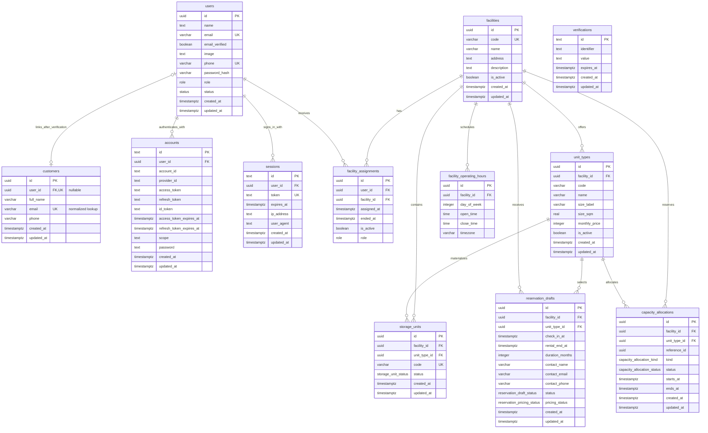

# storeX database diagram

This diagram records every table and column currently declared in
`packages/database/src/schema`. Booking, Rental, Payment and guest access tables
are future work and do not exist in the current schema.

## Existing constraints and behavior

- UUID primary keys on `users`, `customers`, `facilities`, `facility_assignments`,
  `unit_types`, `storage_units`, `facility_operating_hours`, `reservation_drafts`
  and `capacity_allocations` default to generated random UUIDs. Auth tables
  `accounts`, `sessions` and `verifications` use text primary keys.
- `users.email`, `users.phone`, `facilities.code`, `storage_units.code` and
  `sessions.token` are unique. `users.phone` is nullable. `customers.user_id` is
  nullable and unique. `customers.email` is unique by its trimmed, lowercase
  value; its index is an expression index, not a plain column constraint.
- Varchar limits are `users.email` 255, `users.phone` 20,
  `users.password_hash` 255; `customers.full_name` 150, `customers.email` 320,
  `customers.phone` 32; `facilities.code` 50, `facilities.name` 150;
  `unit_types.code` 80, `unit_types.name` 100, `unit_types.size_label` 50;
  `storage_units.code` 80; `facility_operating_hours.timezone` 64; and
  reservation draft contact name/email/phone 150/320/32.
- Nullable columns are `users.image`, `users.phone`, `users.password_hash`,
  `users.role`, `users.status`, `customers.user_id`, `facilities.description`,
  `facility_assignments.ended_at`, `sessions.ip_address`,
  `sessions.user_agent`, and the optional token, expiry, scope and password
  fields in `accounts`. Every other column shown is required.
- Enum values are `role`: `CUSTOMER`, `FACILITY_STAFF`, `FACILITY_MANAGER`,
  `BUSINESS_OPERATION_MANAGER`, `SYSTEM_ADMIN`; `status`: `ACTIVE`, `INACTIVE`;
  `storage_unit_status`: `AVAILABLE`, `RESERVED`, `OCCUPIED`, `MAINTENANCE`,
  `INSPECTION`, `RETURN_PENDING`, `LOCKED`, `INACTIVE`;
  `reservation_draft_status`: `DRAFT`; `reservation_pricing_status`:
  `PRICING_NOT_CONFIGURED`; `capacity_allocation_kind`: `HOLD`, `BOOKING`; and
  `capacity_allocation_status`: `ACTIVE`, `RELEASED`, `EXPIRED`.
- Composite unique indexes exist on `facility_assignments(user_id, facility_id)`,
  `unit_types(facility_id, code)`, `unit_types(id, facility_id)` and
  `facility_operating_hours(facility_id, day_of_week)`.
- `storage_units`, `reservation_drafts` and `capacity_allocations` each use a
  composite foreign key `(unit_type_id, facility_id)` to
  `unit_types(id, facility_id)`. `capacity_allocations.reference_id` is a UUID
  reference value without a database foreign key at this stage.
- User foreign keys use `ON DELETE CASCADE` for `accounts`, `sessions` and
  `facility_assignments`, and `ON DELETE SET NULL` for `customers.user_id`.
  Facility foreign keys use `ON DELETE CASCADE` for `unit_types`,
  `storage_units`, `facility_operating_hours` and `facility_assignments`, and
  `ON DELETE RESTRICT` for reservation drafts and capacity allocations.
  Composite Unit Type foreign keys use `ON DELETE RESTRICT`.
- `created_at` and `updated_at` columns default to `now()` wherever shown;
  `assigned_at` also defaults to `now()`. `facilities.is_active`,
  `unit_types.is_active` and `facility_assignments.is_active` default to true.
  `storage_units.status` defaults to `AVAILABLE`,
  `reservation_drafts.status` to `DRAFT`,
  `reservation_drafts.pricing_status` to `PRICING_NOT_CONFIGURED`, and
  `capacity_allocations.status` to `ACTIVE`. The default operating timezone is
  `Asia/Ho_Chi_Minh`.

For public catalog queries, a facility is eligible when it is active and has at
least one `storage_units.status = AVAILABLE`. Unit Type availability is grouped
by `unit_types.id` and counts only `AVAILABLE` units. Reservation, hold and
booking flows reference the Unit Type ID; a physical unit is assigned later by
operations and is never selected by the customer.

## M0 customer identity decision (#77)

`users` represents authentication identity. `customers` represents the renter in
the business domain. A customer can exist without a User account, so
`customers.user_id` is nullable. The nullable unique index allows at most one
Customer to be linked to a User. Checkout reuses an existing Customer when the
trimmed, lowercase email matches; otherwise it creates a Customer. The unique
email index keeps this rule consistent under concurrent checkouts. Matching an
email for checkout association does not itself prove the guest owns that email
or authorize access to previous bookings. An unverified checkout must not
overwrite an existing Customer's profile fields or `user_id`; its submitted
name, email and phone belong in the new Booking's contact snapshot. Deleting a
User unlinks its Customer rather than deleting business history.

The current reservation draft stores the guest's name, email and phone without
requiring a User or creating a Customer. Booking and Rental will reference
`customers.id`, never `users.id`, when their tables are introduced by their
respective issues. A Booking must also retain a snapshot of the contact details
used for that transaction. Successful payment is the point at which checkout
creates or associates the business Customer and Booking. No Booking, Rental or
guest access session table is introduced by this M0 schema change.

Linking a Customer to a User requires verified ownership of the contact channel;
an authenticated session or an equal email string alone does not authorize a
User link. Guest access to a Booking/Rental likewise requires contact
verification and a short-lived, scoped session. Checkout association by email
must never create a guest access session or a User link. Once the Customer is
linked to a User, new bookings associated by that email will belong to the same
Customer and become visible to that User; this is an accepted consequence of
the chosen reuse policy. The tracking mechanism (email OTP or signed magic
link), expiry and claim workflow are **TBD** for the dependent Booking,
tracking and account-linking implementation.
