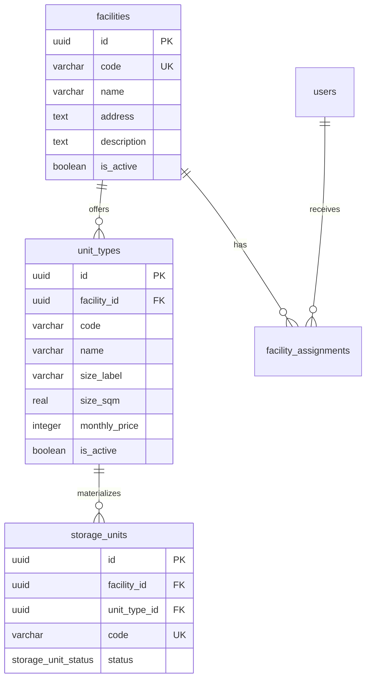

# storeX database diagram — inventory additions for Reservation M1

The `facilities` table is the parent entity for public inventory browsing.

For public catalog queries, a facility is eligible when it is active and has at
least one `storage_units.status = AVAILABLE`. Unit type availability is grouped
by `unit_types.id` and counts only `AVAILABLE` units. Reservation, hold and
booking flows reference the Unit Type ID; a physical unit is assigned later by
operations and is never selected by the customer.

The M0 customer decision intentionally keeps the future business model separate
from authentication: `customers.user_id` is nullable, and Booking/Rental will
reference `customers.id`, not `users.id`. Those tables are introduced by their
own reservation/booking issues and are not created by the browse migration.
